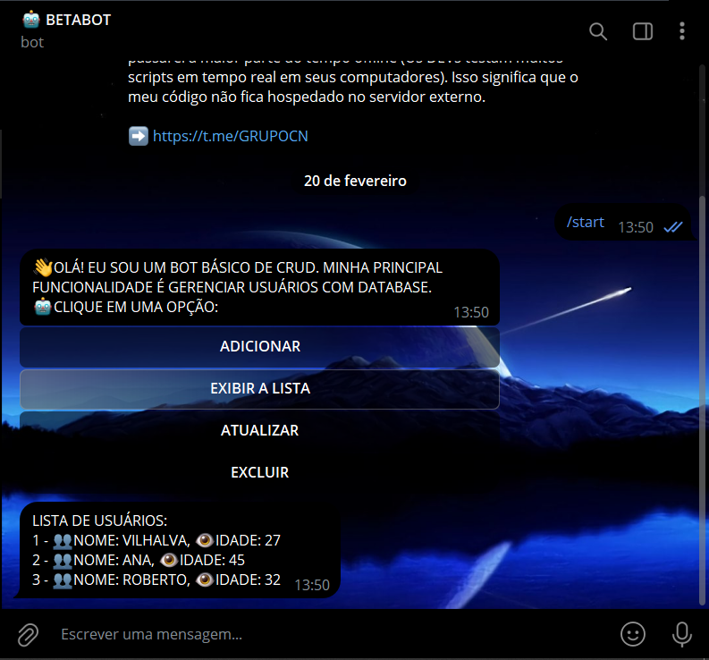
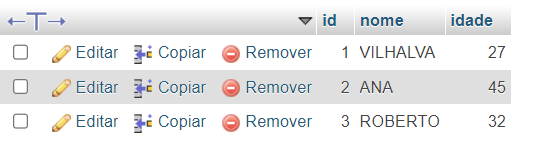

# CRUD TELEBOT EM MYSQL
🤤ESSE É UM BOT DO TELEGRAM DE CRUD EM MYSQL!

 <br>
 <br>

## DESCRIÇÃO:
Este bot do Telegram oferece uma variedade de recursos para gerenciar uma lista de usuários de forma eficiente e conveniente. Aqui estão os principais recursos:

1. **Adicionar Usuário**: Os usuários podem adicionar novos usuários à lista fornecendo seus nomes e idades. O bot guia por meio de uma série de mensagens interativas, solicitando o nome e a idade do novo usuário a ser adicionado.

2. **Listar Usuários**: O bot permite que as pessoas visualizem todos os usuários cadastrados na lista. Ao selecionar essa opção no menu, ele exibe uma lista detalhada de todos os usuários, incluindo seus nomes e idades.

3. **Atualizar Usuário**: Os usuários têm a capacidade de atualizar as informações de um usuário existente na lista. O bot solicita o nome do usuário a ser atualizado, seguido pelo novo nome e idade a serem atualizados. Isso permite que as pessoas mantenham a lista de usuários atualizada com as informações mais recentes.

4. **Excluir Usuário**: O bot permite que as pessoas excluam um usuário específico da lista. Ao selecionar essa opção no menu e fornecer o nome do usuário a ser excluído, o bot remove o usuário da lista, garantindo que apenas usuários válidos sejam mantidos na lista.

5. **Interface Amigável**: O bot oferece uma interface de usuário amigável, apresentando um menu inicial com botões inline que facilitam a navegação e a interação. Os usuários podem acessar facilmente as diferentes opções do bot e seguir as instruções fornecidas para realizar as operações desejadas.

6. **Feedback de Ações**: O bot fornece feedback claro e informativo após a conclusão de cada ação. Os usuários recebem mensagens de confirmação ou feedback de erro, garantindo uma experiência de usuário suave e sem problemas.

7. **Operações CRUD**: Este bot segue o paradigma CRUD (Create, Read, Update, Delete), permitindo que as pessoas realizem todas as operações básicas de manipulação de dados em uma lista de usuários diretamente do Telegram.

## EXECUTANDO O PROJETO:
1. **Configuração do Banco de Dados:**
   - Antes de executar o bot, é necessário importar o arquivo `DATABASE.sql`. Se não estiver familiarizado com o processo de importação, [confira este curso](https://github.com/VILHALVA/CURSO-DE-MYSQL) para orientações detalhadas.

2. **Editar o código:**
   - Certifique-se de substituir "localhost", "seu_usuario", "sua_senha" e "sua_base_de_dados" pelas informações corretas do seu banco de dados MySQL.

3. **Coloque o Token:**
   - Antes de executar o programa, é necessário substituir o token do seu bot, o qual pode ser obtido por meio do [@BotFather](https://t.me/BotFather). Certifique-se também de que todas as dependências estejam instaladas em sua máquina. Se você não estiver familiarizado com esses passos, confira nosso [curso completo sobre a criação de bots no Telegram](https://github.com/VILHALVA/CURSO-DE-TELEGRAM-BOT) para obter orientações detalhadas.

4. **Inicie o Bot:**
   - Execute o bot do Telegram em Python iniciando-o com o seguinte comando:
```bash
   python CODIGO.py
```
   - Inicie o bot enviando o comando `/start`. Receba uma mensagem de boas-vindas e clique no botão inline.

## SAIBA MAIS:
- [PROJETO CRIADO PELO VILHALVA](https://github.com/VILHALVA)
- [FAÇA OS NOSSOS CURSOS](https://github.com/VILHALVA?tab=repositories&q=+topic:CURSO)

